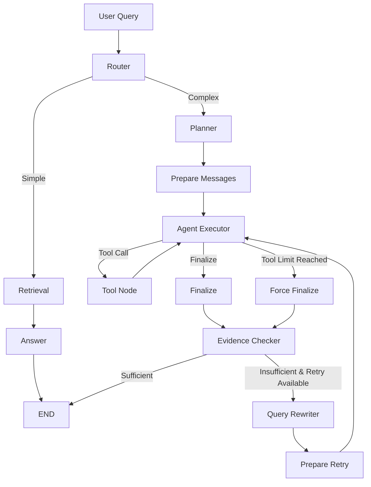

# Agent Intelligence Platform

> 基于 **LangGraph + RAG + Structured Tool Calling** 的企业文档研究与决策分析 Agent

Agent Intelligence Platform 是一个面向企业 AI 产品研究、技术资料分析、竞品比较与知识检索场景的 Research Agent 项目。

项目重点不只是“让 LLM 回答文档问题”，而是构建一套**可观察、可评估、可重试**的研究工作流：系统会根据问题复杂度选择简单 RAG 或多步骤 Agent 流程，并在复杂任务中执行研究规划、结构化工具调用、证据评估，以及基于证据缺口的定向重试。

当前项目同时正在从“固定本地知识库”升级为“用户可上传并长期保存的 Document Library”，使多个 Research Conversation 可以共享同一套企业文档知识库。

***

使用方法：
后端：uvicorn app.api.main:app --reload
前端：npm run dev

## 1. Project Goals

传统企业研究通常需要人工完成：

```text
收集资料
↓
阅读文档
↓
提取关键事实
↓
比较产品 / 技术方案
↓
检查证据是否充分
↓
补充缺失信息
↓
生成研究报告
```

本项目尝试将这一流程抽象为一个 Evidence-driven Research Agent：

```text
Documents
↓
Retrieval
↓
Router
↓
Planner / Agent
↓
Structured Tools
↓
Evidence Checker
↓
Evidence-driven Retry
↓
Final Report
```

核心工程目标包括：

- 让简单问题走低成本的 RAG 路径
- 让复杂研究问题进入多步骤 Agent Workflow
- 使用 Structured Tool Calling，而不是依赖自由文本解析工具意图
- 对研究结果进行 Evidence Sufficiency 检查
- 基于 Evidence Gaps 生成定向 Retry Query
- 控制 Tool Loop，防止 Agent 无限循环
- 进行 Evidence 去重和上下文控制
- 记录 Token、LLM Calls、Tool Trace、Retry 和 Latency
- 建立可持久化的企业文档知识库
- 提供可交互的 Web Research UI

***

## 2. Current Capabilities

### Agent Workflow

- Task Type Classification
- Simple / Complex Complexity Routing
- Research Planning
- LangGraph State Management
- Structured Tool Calling
- Tool Execution Loop
- Tool Loop Limit
- Force Finalize
- Evidence Checker
- Evidence-driven Retry
- Query Rewriter
- Retry Limit

### Context Engineering

- Retrieval Cache
- Evidence ID Tracking
- Evidence Deduplication
- Cross-retry Deduplication
- Page Diversity Control
- New / Duplicate Evidence Statistics

### RAG & Document Intelligence

- PDF parsing
- Chunking
- BGE-M3 embeddings
- FAISS vector retrieval
- Persistent FAISS index
- Persistent PDF storage
- SQLite document metadata
- Document upload API
- Document listing API
- Document deletion workflow
- File hash based duplicate detection
- Document / page / chunk metadata

### Observability

Research API currently records:

```text
Input Tokens
Output Tokens
Total Tokens
LLM Calls
Execution Time
Tool Executions
Tool Rounds
Evidence Score
Retry Count
Unique Evidence
Duplicate Evidence
```

### Frontend

- React + Vite Research UI
- New Research
- Recent Research session switching
- Markdown report rendering
- Research execution status
- Stop button with AbortController
- Research Details drawer
- Token / Latency display
- PDF report export
- Document Library sidebar
- Multiple PDF upload
- Document processing status
- Document deletion UI

***

## 3. Agent Architecture



### Simple Task

适用于事实型、单点知识查询：

```text
START
↓
Router
↓
Retrieval
↓
Answer
↓
END
```

例如：

```text
Google ADK 是什么？
```

简单路径不会进入复杂 Tool Loop，也不会默认执行 Evidence Checker，因此 API 中可能出现：

```json
{
  "tool_rounds": 0,
  "evidence": {
    "evaluated": false
  },
  "retry": {
    "count": 0
  }
}
```

### Complex Task

适用于产品比较、行业分析、多维研究任务：

```text
START
↓
Router
↓
Planner
↓
Prepare Messages
↓
Agent Executor
↓
Structured Tool Calling
↓
Tool Loop
↓
Finalize
↓
Evidence Checker
↓
Sufficient → END
        or
Insufficient → Query Rewriter → Retry
```

例如：

```text
比较 OpenAI、Google 和 DeepSeek 在 Agent Tools 设计上的差异。
```

***

## 4. Router

Router 负责判断用户问题的研究类型和复杂度。

当前 Task Type 包括：

```text
knowledge_query
competitive_analysis
industry_analysis
product_comparison
other
```

Complexity 包括：

```text
simple
complex
```

例如：

```text
Google ADK 是什么？
```

可能被判断为：

```text
task_type = knowledge_query
complexity = simple
```

而：

```text
比较 OpenAI、Google 和 DeepSeek 在 Agent Tools 设计上的差异。
```

可能进入：

```text
task_type = product_comparison
complexity = complex
```

这样可以避免所有问题都进入高成本 Agent Loop。

***

## 5. Planner

复杂问题进入 Planner。

Planner 会先将研究任务拆解成可执行步骤，例如：

```text
1. 检索 Google Agent Tools 相关信息
2. 检索 OpenAI Agent Tools 相关信息
3. 检索 DeepSeek Tool Calling 相关信息
4. 提取关键能力
5. 对比技术差异
6. 综合形成结论
```

Planner 的目标是让复杂任务具备显式 Research Plan，而不是让模型直接对问题进行一次性回答。

***

## 6. Structured Tool Calling

复杂 Research Flow 使用 Structured Tool Calling 进行工具选择与执行。

典型流程：

```text
Agent Executor
↓
Generate Tool Call
↓
Tool Node
↓
Tool Result
↓
ToolMessage
↓
Agent Executor
↓
Continue / Finalize
```

当前 Tool 层主要围绕企业 AI 产品研究构建，包括搜索、信息提取和产品比较能力。

现有代码仍保留 company-oriented tool naming，例如：

```text
company_search
extract_company_info
compare_companies
```

随着 Document Library 泛化，后续会逐步演进为：

```text
company_search          → document_search
extract_company_info    → extract_document_info
compare_companies       → compare_documents
```

重构原则是先保证 Research Workflow 稳定，再调整工具命名和抽象层。

***

## 7. Tool Loop Control

为了避免 Agent 无限调用工具，系统实现：

```text
Tool Loop Limit
+
Force Finalize
```

正常情况下：

```text
Agent
↓
Tool
↓
Agent
↓
Tool
↓
Agent
↓
Finalize
```

如果达到 Tool Loop Limit：

```text
Agent Executor
↓
Force Finalize
↓
Evidence Checker
```

Force Finalize 会根据已经获取的 Tool Result 生成有限结论，而不是继续无限调用工具。

***

## 8. Evidence Checker

复杂 Research 完成后，不会立即返回 Final Report。

系统会进入：

```text
Evidence Checker
```

用于评估：

```text
Evidence Sufficient?
Evidence Score
Evidence Gaps
```

例如：

```json
{
  "sufficient": false,
  "score": 0.63,
  "gaps": [
    "缺少 Google 对工具权限控制的具体说明",
    "缺少 DeepSeek Tool Calling 生命周期相关证据"
  ]
}
```

Evidence Checker 的目的，是把“模型觉得自己回答完了”和“当前证据真的足够支持结论”区分开。

***

## 9. Evidence-driven Retry

如果 Evidence Checker 判断证据不足，系统不会简单重新执行原问题。

而是根据 Evidence Gaps 生成定向查询：

```text
Initial Research
↓
Evidence Checker
↓
Missing Evidence
↓
Query Rewriter
↓
Targeted Retry Query
↓
Additional Retrieval / Tool Execution
↓
Evidence Checker
↓
Final Report
```

例如：

```text
原问题：
比较 Google 和 OpenAI Agent Tools
```

第一轮发现：

```text
缺少 Google MCP integration evidence
```

则 Query Rewriter 可以生成：

```text
Google Agent MCP tool ecosystem integration
```

用于第二轮定向研究。

系统同时设置 Retry Limit，防止无限 Retry。

***

## 10. Context Engineering

为了控制上下文增长和重复检索，项目实现了一系列 Context Engineering 机制。

包括：

```text
Retrieval Cache
Evidence Deduplication
Evidence ID Tracking
Cross-retry Deduplication
Page Diversity
```

典型问题：

```text
Retry 1
→ A B C

Retry 2
→ A B C

Retry 3
→ A B C
```

如果不处理，Context 会持续增长，但没有获得新信息。

当前系统会记录：

```text
unique evidence
new evidence
duplicate evidence
last retry new evidence
last retry duplicate evidence
```

这些指标也会显示在 Research Details 中。

***

## 11. Persistent Document Library

项目正在将知识层从固定 OpenAI / Google 文档升级为持久化 Document Library。

目标用户体验：

```text
第一次打开系统
↓
上传：
DeepSeek.pdf
Google.pdf
OpenAI.pdf
↓
Parse
↓
Chunk
↓
Embedding
↓
Persistent FAISS
↓
Ready
```

之后：

```text
Conversation A
Conversation B
Conversation C
```

都可以共享同一个 Document Library。

重新启动系统后，也不需要重新上传文档。

### Architecture

```text
Workspace
│
├── Document Library
│   ├── DeepSeek.pdf
│   ├── Google.pdf
│   └── OpenAI.pdf
│
├── Conversation A
├── Conversation B
└── Conversation C
```

Document Library 和 Conversation 是解耦的。

也就是说：

```text
New Research
```

只创建新的研究对话，不会创建新的知识库。

***

## 12. Document Processing Pipeline

PDF 上传后执行：

```text
Upload PDF
↓
Validate
  ├── 文件名必须以 .pdf 结尾
  ├── 文件头必须是 %PDF（magic bytes 校验）
  ├── 文件大小 ≤ 50 MB
  └── SHA-256 hash 去重（已存在 ready/processing 文档则直接返回）
↓
Save Original File (data/documents/{document_id}.pdf)
↓
SQLite status = processing
↓
Parse PDF (LangChain PyPDFLoader)
↓
Chunk (RecursiveCharacterTextSplitter, chunk_size=1200, overlap=200)
↓
BGE-M3 Embedding
↓
FAISS add_documents
↓
save_local() → data/vector_store/
↓
SQLite status = ready
```

处理失败时 SQLite 状态会置为 `failed` 并记录错误信息。

处理完成后，文档可以被之后的所有 Research Conversation 使用。

> 注意：上传链路当前使用 LangChain `PyPDFLoader`（依赖 `pypdf`），文件上传依赖 `python-multipart`，这两个包需要单独安装（见 Local Development）。

***

## 13. Document Metadata

SQLite 保存文档 Metadata，例如：

```text
document_id
filename
stored_filename
file_path
file_hash
status
page_count
chunk_count
file_size
created_at
updated_at
```

每一个 Chunk 还会保存：

```python
{
    "document_id": "doc_xxx",
    "filename": "Google-Agent.pdf",
    "page": 18,
    "chunk_id": "doc_xxx_p18_c2",
    "source": "Google-Agent.pdf"
}
```

这些字段为后续 Sources / Citation UI 提供基础。

***

## 14. Storage Model

当前本地存储结构：

```text
data/
├── app.db                        # SQLite：Document Library 元数据
│
├── companies/                    # Legacy 固定知识库源文件
│   ├── google/*.pdf
│   └── openai/*.pdf
│
├── documents/                    # Document Library 上传的原始 PDF
│   ├── doc_xxx.pdf
│   └── ...
│
└── vector_store/
    ├── index.faiss
    └── index.pkl
```

职责划分：

| Layer      | Responsibility                                    |
| ---------- | ------------------------------------------------- |
| Filesystem | 保存原始 PDF（`companies/` 为 legacy，`documents/` 为上传库） |
| SQLite     | Document Library metadata / status                |
| FAISS      | Semantic vector retrieval                         |
| BGE-M3     | Embedding generation                              |

### Dual Knowledge Stacks（当前过渡状态）

项目中目前并存两套知识栈，这是 Document Library 迁移过程中的过渡状态：

```text
Legacy Research Knowledge Base（Agent 当前实际使用）
├── app/rag/                       # pymupdf 解析 + FAISS
├── data/companies/                # 固定 OpenAI / Google PDF
├── scripts/ingest.py              # 离线构建索引
└── data/vector_store/             # 索引输出

Persistent Document Library（上传 / 持久化，尚未接入 Agent）
├── app/documents/                 # PyPDFLoader 解析 + SQLite + FAISS
├── data/documents/                # 上传的 PDF
├── data/app.db                    # 文档元数据
└── data/vector_store/             # 索引输出（与 legacy 共用同一目录）
```

需要注意：

- Simple Retrieval 节点和 `company_search` 等工具当前读取的是 **legacy** `app/rag` 索引。
- 上传文档写入的是 **Document Library** 索引，二者在磁盘上共用 `data/vector_store/` 目录与 `index.faiss / index.pkl` 文件名。
- legacy 侧的向量库在进程内有 cache，上传新文档后不会自动被 Agent 看到，需要重启 Python 进程（并后续完成检索链路切换）。
- 把 Agent 的两条检索路径统一切到 Document Library，是当前 Roadmap 的最高优先级（见 Roadmap）。

***

## 15. Document Deletion

系统支持：

```http
DELETE /api/documents/{document_id}
```

当前 MVP 的删除策略优先保证正确性。

例如当前有：

```text
DeepSeek.pdf
Google.pdf
OpenAI.pdf
```

删除 Google 后：

```text
找到剩余 Ready Documents
↓
重新 Parse 剩余 PDF
↓
重新 Chunk
↓
重新 Embedding
↓
重建 FAISS
↓
删除 Google SQLite metadata
↓
删除 Google 原始 PDF
```

最终：

```text
DeepSeek.pdf
OpenAI.pdf
```

仍然可被 Research Agent 使用，而 Google 的向量不会残留。

这种方式对于当前小规模文档库是可靠的，但大型系统后续应升级为基于 vector ID / document ID mapping 的精确删除。

***

## 16. Observability

Research API 对整个 LangGraph Run 统计 Token Usage 和端到端耗时。

示例：

```json
{
  "token_usage": {
    "input_tokens": 2067,
    "output_tokens": 582,
    "total_tokens": 2649,
    "llm_calls": 2
  },
  "timing": {
    "total_seconds": 54.202,
    "total_ms": 54201.9
  }
}
```

前端可以展示：

```text
输入 Token
输出 Token
总 Token
模型调用次数
总执行时间
```

复杂 Agent 还会展示：

```text
Tool Executions
Tool Rounds
Evidence Score
Retries
Unique Evidence
Duplicate Evidence
```

这部分用于观察 Agent 的执行成本、上下文增长和研究可靠性。

***

## 17. Research Details

前端 Research Details Drawer 当前展示：

```text
研究详情

概览
├── 任务类型
├── 复杂度
├── 证据评分
└── 重试次数

研究计划

工具执行

证据评估
├── Evidence Score
├── Evidence Sufficient
└── Evidence Gaps

证据统计
├── Unique
├── New
├── Duplicates
└── Tool Rounds

执行指标
├── Input Token
├── Output Token
├── Total Token
├── LLM Calls
└── Execution Time

证据驱动重试
```

***

## 18. Frontend

Frontend 使用 React + Vite。

当前 UI 包括：

```text
Sidebar
├── New Research
├── Document Library
│   ├── PDF List
│   ├── Upload
│   └── Delete
│
└── Recent Research

Main
├── Research Conversation
├── Research Status
├── Markdown Report
├── Execution Metrics
├── Download PDF
├── Research Details
└── Composer
```

Document Library 和 Recent Research 在产品层面是独立概念：

```text
Documents
=
长期知识库

Recent
=
研究对话历史
```

***

## 19. Stop Research

Research 运行过程中，Send Button 会切换为 Stop：

```text
↑
↓
■
```

点击 Stop 后：

```text
AbortController.abort()
↓
前端停止等待
↓
Researching 状态消失
↓
输入框恢复
↓
已取消请求的结果不会重新写回 UI
```

当前限制是：

```text
Frontend Abort        ✅
HTTP request abort    ✅
Ignore cancelled UI   ✅

Backend graph kill    ❌
```

因为后端当前仍使用同步：

```python
research_graph.invoke(...)
```

通过 threadpool 执行。

所以前端取消请求后，Python worker 中的 Graph 可能继续执行到结束。

后续可以升级为：

```text
request_id
+
cancellation state
+
LangGraph cooperative cancellation
```

***

## 20. PDF Report Export

最终 Research Answer 支持：

```text
Download PDF
```

PDF 可以包含：

```text
Research Query
Research Metadata
Research Plan
Research Report
Evidence Evaluation
Evidence Tracking
Execution Metrics
Retry Information
```

Frontend 使用：

```text
html2pdf.js
```

将浏览器渲染后的 Research Report 导出为 PDF。

***

## 21. Evaluation

项目包含独立的 Evaluation Cases 和 Evaluation Result Snapshot：

```text
evals/
├── test_cases.json
└── results/
    └── evaluation_YYYYMMDD_HHMMSS.json
```

运行 Evaluation（会真实调用 LLM，耗时较长）：

```bash
python -m scripts.run_evaluation
```

结果会写入 `evals/results/` 并在终端输出汇总指标。

当前 baseline（snapshot: `evaluation_20260906_182612.json`）：

| Metric                       | Result |
| ---------------------------- | -----: |
| Total Cases                  |     12 |
| Passed                       |      9 |
| Failed                       |      3 |
| Pass Rate                    |    75% |
| Graph Execution Success Rate |   100% |
| Task Type Accuracy           | 83.33% |
| Complexity Accuracy          | 83.33% |
| Tool Expectation Pass Rate   | 83.33% |
| Retry Limit Pass Rate        |   100% |

Evaluation 重点检查：

- Graph 是否成功执行
- Task Type 是否正确
- Complexity Routing 是否正确
- Tool 使用是否符合预期
- Evidence Checker 是否按预期触发
- Retry 是否按证据不足触发
- Retry Limit 是否有效

***

## 22. Tech Stack

### Agent / Backend

- Python 3.11
- LangGraph
- LangChain
- DeepSeek Chat API
- OpenAI-compatible Chat interface
- FastAPI
- Pydantic

### RAG

- BAAI/bge-m3
- FAISS
- LangChain Document Loaders
- LangChain Text Splitters
- PDF Parsing（legacy 链路使用 PyMuPDF；上传链路使用 LangChain PyPDFLoader / pypdf）

### Persistence

- SQLite
- Local filesystem
- Persistent FAISS index

### Frontend

- React 19
- Vite
- react-markdown
- html2pdf.js
- Oxlint（`npm run lint`）

### Evaluation / Observability

- Custom evaluation cases
- Token Usage
- LLM Call Count
- Tool Trace
- Evidence Metrics
- Retry Metrics
- End-to-end Latency

***

## 23. Project Structure

```text
agent-intelligence-platform/
│
├── app/
│   │
│   ├── agent/
│   │   ├── graph.py                    # LangGraph 工作流定义
│   │   ├── state.py                    # AgentState
│   │   │
│   │   └── nodes/
│   │       ├── router.py               # 任务类型 / 复杂度路由
│   │       ├── planner.py              # 研究计划
│   │       ├── retrieval.py            # Simple RAG 检索节点
│   │       ├── answer.py               # Simple RAG 回答
│   │       ├── prepare_messages.py
│   │       ├── agent_executor.py
│   │       ├── tool_node.py            # 工具执行 + Evidence 去重
│   │       ├── tool_router.py
│   │       ├── finalize.py
│   │       ├── force_finalize.py
│   │       ├── evidence_checker.py
│   │       ├── evidence_router.py
│   │       ├── evidence_dedup.py
│   │       ├── query_rewriter.py
│   │       └── prepare_retry.py
│   │
│   ├── api/
│   │   ├── main.py                     # FastAPI 入口 + /api/research
│   │   ├── schemas.py                  # Pydantic 请求 / 响应模型
│   │   └── documents.py                # /api/documents 上传 / 列表 / 删除
│   │
│   ├── documents/                      # Persistent Document Library
│   │   ├── parser.py                   # PyPDFLoader 解析 + 切分
│   │   ├── repository.py               # SQLite 元数据
│   │   ├── retrieval.py                # 上传库检索接口（待接入 Agent）
│   │   ├── service.py                  # 上传 / 删除 / 校验主流程
│   │   └── vector_store.py             # 上传库 FAISS 持久化
│   │
│   ├── rag/                            # Legacy 固定知识库
│   │   ├── loader.py                   # PyMuPDF 读取 data/companies
│   │   ├── splitter.py
│   │   ├── embeddings.py               # BGE-M3
│   │   ├── retriever.py
│   │   ├── vector_store.py
│   │   └── vector_store_cache.py
│   │
│   ├── tools/
│   │   ├── search.py                   # 向量检索 + 去重 + Page Diversity
│   │   ├── search_tool.py              # company_search
│   │   ├── extractor.py
│   │   ├── extract_tool.py             # extract_company_info
│   │   └── comparison_tool.py          # compare_companies
│   │
│   ├── services/
│   │   └── llm.py                      # OpenAI-compatible Chat client
│   │
│   ├── observability/
│   │   └── usage_tracker.py
│   │
│   └── config.py                       # pydantic-settings 环境配置
│
├── frontend/
│   │
│   ├── package.json
│   │
│   └── src/
│       ├── App.jsx
│       ├── App.css
│       │
│       └── components/
│           ├── Sidebar.jsx
│           ├── DocumentLibrary.jsx
│           ├── ChatMessage.jsx
│           ├── Composer.jsx
│           ├── ResearchStatus.jsx
│           └── ResearchDrawer.jsx
│
├── data/
│   ├── app.db                          # SQLite 文档元数据
│   ├── companies/                      # legacy 固定 PDF（google/ openai/）
│   ├── documents/                      # 上传的 PDF（doc_xxx.pdf）
│   └── vector_store/                   # FAISS index.faiss / index.pkl
│
├── evals/
│   ├── test_cases.json
│   └── results/                        # evaluation_*.json snapshot
│
├── scripts/
│   ├── ingest.py                       # 构建 legacy FAISS 索引
│   ├── run_agent.py                    # 命令行单次 Research
│   ├── run_evaluation.py              # 运行评测集
│   └── test_*.py                       # 各节点 / 工具的验证脚本
│
├── tests/                              # Phase 1-3 测试说明文档（.md）
│
├── requirements.txt
├── .env.example
├── Dockerfile                          # 当前为空占位，Docker 支持尚未实现
└── README.md
```

***

## 24. API

### Health Check

```http
GET /health
```

Response:

```json
{
  "status": "ok"
}
```

### Research

```http
POST /api/research
Content-Type: application/json
```

Request:

```json
{
  "query": "比较 OpenAI 和 Google 在 Agent Tools 设计上的共同点和差异。"
}
```

Research Response 包含：

```text
query
task_type
complexity
plan
answer
tool_trace
tool_rounds
evidence
retry
evidence_tracking
token_usage
timing
```

### List Documents

```http
GET /api/documents
```

Example:

```json
[
  {
    "document_id": "doc_xxx",
    "filename": "Google-Agent.pdf",
    "status": "ready",
    "pages": 68,
    "chunks": 142,
    "file_size": 4829912,
    "error": "",
    "created_at": "...",
    "updated_at": "..."
  }
]
```

### Upload Document

```http
POST /api/documents
Content-Type: multipart/form-data
```

Current MVP supports PDF files only:

- 仅接受 `.pdf` 文件，且文件头必须为 `%PDF`
- 文件大小上限 50 MB（超出返回 413）
- 基于 SHA-256 的重复检测：内容相同的文档已存在且状态为 `ready` / `processing` 时，直接返回已有记录，不会重复入库
- 上传后同步完成解析、切分、Embedding 与索引写入，返回时文档即为 `ready`

### Delete Document

```http
DELETE /api/documents/{document_id}
```

Example response:

```json
{
  "document_id": "doc_xxx",
  "filename": "Google-Agent.pdf",
  "deleted": true,
  "remaining_documents": 2,
  "remaining_chunks": 296
}
```

***

## 25. Local Development

### 1. Clone

```bash
git clone https://github.com/AmilyTsang/agent-intelligence-platform.git
cd agent-intelligence-platform
```

### 2. Python Environment

推荐 Python 3.11。

```bash
conda create -n agent-platform python=3.11
conda activate agent-platform
```

### 3. Install Backend Dependencies

```bash
pip install -r requirements.txt
```

Document Upload 还需要（尚未写入 requirements.txt）：

```bash
pip install python-multipart pypdf
```

`langchain-huggingface` 已包含在 `requirements.txt` 中；
代码在 import 失败时会回退到 `langchain_community.embeddings.HuggingFaceEmbeddings`。

### 4. Configure Environment

复制：

```text
.env.example
```

为：

```text
.env
```

示例：

```env
LLM_API_KEY=your_api_key
LLM_BASE_URL=https://api.deepseek.com
LLM_MODEL=deepseek-chat

EMBEDDING_MODEL=BAAI/bge-m3
```

可选配置（Document Library 向量库直接读取系统环境变量）：

```env
EMBEDDING_MODEL_NAME=BAAI/bge-m3
EMBEDDING_DEVICE=cpu
```

### 5. Build Legacy Knowledge Base

Agent 的 Simple Retrieval 和 `company_search` 等工具当前依赖 legacy 知识库。

首次运行前，需要先从 `data/companies/` 构建 FAISS 索引：

```bash
python -m scripts.ingest
```

该命令会完成：

```text
Load data/companies/**/*.pdf (PyMuPDF)
↓
Split
↓
BGE-M3 Embedding
↓
Save data/vector_store/index.faiss + index.pkl
```

> 如果跳过这一步，后端启动后首次 Research 会因为找不到向量索引而报错
> （`Vector store not found ... Please run scripts.ingest first.`）。
>
> 新增或替换 `data/companies/` 中的 PDF 后，重新执行一次 ingest 并重启后端即可。

### 6. Start Backend

```bash
uvicorn app.api.main:app --reload
```

Backend:

```text
http://127.0.0.1:8000
```

Swagger:

```text
http://127.0.0.1:8000/docs
```

> 前端默认访问 `http://127.0.0.1:8000`，后端 CORS 已允许
> `http://localhost:5173` 和 `http://127.0.0.1:5173`。

### 7. Start Frontend

打开另一个终端：

```bash
cd frontend
npm install
npm run dev
```

Frontend:

```text
http://localhost:5173
```

前端代码检查：

```bash
npm run lint
```

### 8. CLI Scripts

不启动 Web 服务时，也可以直接使用脚本：

```bash
# 命令行交互式执行一次 Research（启动后输入研究问题）
python -m scripts.run_agent

# 运行评测集（真实调用 LLM，结果写入 evals/results/）
python -m scripts.run_evaluation

# 各节点 / 工具的临时验证脚本
python -m scripts.test_tools
python -m scripts.test_evidence_checker
python -m scripts.test_query_rewriter
python -m scripts.test_retrieval_cache
python -m scripts.test_retry_evidence_dedup
python -m scripts.test_extract
python -m scripts.test_compare
```

***

## 26. Example Research Questions

### Simple Knowledge Queries

```text
OpenAI 文档中 Agent 是什么？

Google ADK 是什么？

Google Agentspace 是什么？

OpenAI 文档如何定义 Tools？

Agent 为什么需要工具？
```

### Complex Research Queries

```text
比较 OpenAI 和 Google 在 Agent Tools 设计上的共同点和差异。

比较 DeepSeek、Google 和 OpenAI 在 Agent Tool Calling 上的设计差异。

分析不同 Agent 平台在工具调用、治理、生态集成和生命周期管理方面的差异。

比较三个平台对于 Agent 开发、部署、治理和工具生态的不同设计路径。
```

***

## 27. Current Development Status

### Completed / Working

- [x] RAG baseline
- [x] Router
- [x] Planner
- [x] Structured Tool Calling
- [x] Tool Loop
- [x] Tool Loop Limit
- [x] Force Finalize
- [x] Evidence Checker
- [x] Evidence-driven Retry
- [x] Query Rewriter
- [x] Evidence Deduplication
- [x] Cross-retry Deduplication
- [x] Page Diversity Control
- [x] Context Engineering metrics
- [x] Evaluation baseline
- [x] FastAPI Research API
- [x] React Research UI
- [x] New Research
- [x] Recent Session Switching
- [x] Research Details Drawer
- [x] Token Usage
- [x] Execution Time
- [x] PDF Report Export
- [x] Persistent Document Library foundation
- [x] PDF Upload API
- [x] Document List API
- [x] SQLite Document Metadata
- [x] Persistent PDF Storage
- [x] Persistent FAISS
- [x] Document Delete workflow
- [x] Document Library frontend
- [x] Stop Research frontend interaction
- [x] Upload validation（PDF-only / magic bytes / 50 MB limit）
- [x] SHA-256 duplicate upload detection
- [x] CLI scripts（ingest / run\_agent / run\_evaluation）

### In Integration / Validation

- [ ] Document delete end-to-end validation
- [ ] Route Simple Retrieval to uploaded Document Library
- [ ] Route Agent Search Tools to uploaded Document Library
- [ ] Filename / Page Source Panel
- [ ] Persistent Conversation History

### Later

- [ ] Backend cooperative cancellation
- [ ] Docker production setup
- [ ] Demo GIF / Video
- [ ] Architecture screenshots
- [ ] Deployment

***

## 28. Known Limitations

1. **Uploaded Document Library is not yet the retrieval source used by the Agent.**\
   The legacy RAG stack (`app/rag/`, fed by `data/companies/` + `scripts/ingest.py`) still serves both the Simple Retrieval node and the `company_search` tools. The two stacks currently also share the same on-disk directory `data/vector_store/` (`index.faiss` / `index.pkl`), and the legacy vector store is cached in-process — newly uploaded documents are not visible to the Agent until the retrieval paths are switched and the backend process is restarted.
2. **Document deletion currently rebuilds the remaining FAISS index.**\
   This favors correctness over deletion speed for the current small-scale MVP.
3. **Recent conversations are currently frontend session state rather than fully persistent backend conversations.**
4. **Stop Research currently aborts the browser request and prevents cancelled results from being written back to the UI, but synchronous** **`research_graph.invoke()`** **may continue executing on the backend worker thread.**
5. **The current project focuses on uploaded / local document evidence rather than open-web research.**
6. **The current MVP is optimized for a small local enterprise document library rather than large-scale multi-tenant production workloads.**
7. **`python-multipart`** **and** **`pypdf`** **are required for document upload but are not yet pinned in** **`requirements.txt`; the** **`Dockerfile`** **is currently an empty placeholder and containerized deployment is not implemented yet.**

***

## 29. Engineering Focus

This project is intentionally designed to explore Agent application engineering rather than model training.

The main engineering questions are:

- When should a request use simple RAG vs. an Agent workflow?
- How should an Agent plan and select structured tools?
- How can evidence quality be evaluated before returning a report?
- How should the system retry when evidence is incomplete?
- How can duplicate evidence and context growth be controlled?
- How should Tool Loop termination be handled?
- How can Agent token cost, latency and execution trace be observed?
- How should uploaded enterprise documents be persisted and reused across research conversations?
- How can a research system remain inspectable instead of behaving like a black-box chatbot?

The goal is to build a Research Agent whose behavior is not only useful, but also:

```text
Inspectable
Testable
Observable
Evidence-aware
```

***

## 30. Roadmap

Current roadmap:

```text
Persistent Document Library
↓
Uploaded-document Retrieval
↓
Document Search Tools
↓
Filename / Page Sources
↓
Persistent Conversations
↓
Docker
↓
Demo Packaging
```

The next highest-priority task is to connect both the Simple Retrieval path and Complex Agent tools to the persistent uploaded Document Library.

Target end-to-end flow:

```text
Upload PDF
↓
Persistent Knowledge Base
↓
New Research
↓
Router
↓
Simple Retrieval
      or
Planner + Agent Tools
↓
Evidence Checker
↓
Evidence-driven Retry
↓
Research Report
↓
Sources
↓
Token / Latency / Tool Trace
↓
Download PDF
```

***

## 31. Target Demo Scenario

A complete demo should support the following workflow:

```text
1. Open Agent Intelligence Platform

2. Upload:
   - DeepSeek.pdf
   - Google.pdf
   - OpenAI.pdf

3. Documents are parsed, chunked and embedded.

4. Open a new Research conversation.

5. Ask:
   Google ADK 是什么？

6. The system routes the request to Simple Retrieval.

7. Open another Research conversation.

8. Ask:
   比较 DeepSeek、Google 和 OpenAI
   在 Agent Tools 设计上的差异。

9. The system:
   Router
   ↓
   Planner
   ↓
   Structured Tool Calling
   ↓
   Evidence Checker
   ↓
   Retry if needed
   ↓
   Final Report

10. View:
    - Research Plan
    - Tool Trace
    - Evidence Score
    - Retry
    - Token Usage
    - Execution Time

11. Download the report as PDF.

12. Restart the application.

13. Previously uploaded documents are still available
    without uploading them again.
```

***

## 32. Why This Project

This project is not intended to be only a PDF chatbot.

The core idea is to combine:

```text
RAG
+
Agent Workflow
+
Structured Tool Calling
+
Evidence Evaluation
+
Context Engineering
+
Observability
+
Persistent Document Intelligence
```

into a single research product prototype.

The project focuses on how a practical Agent system can move from:

```text
Question → LLM Answer
```

toward:

```text
Question
↓
Routing
↓
Research Planning
↓
Evidence Retrieval
↓
Tool Execution
↓
Evidence Evaluation
↓
Targeted Retry
↓
Inspectable Final Report
```

