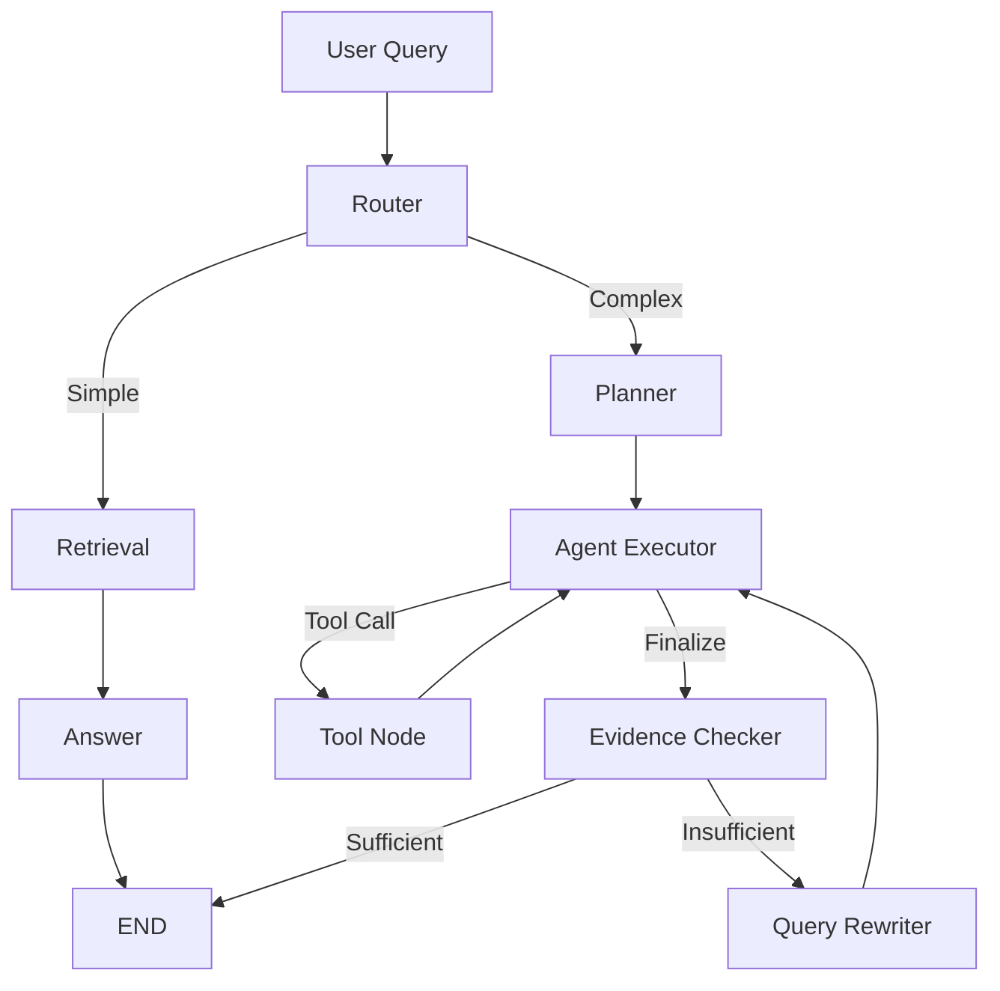

# Agent Intelligence Platform

> 基于 **LangGraph + RAG + Structured Tool Calling** 的企业文档研究 Agent

Agent Intelligence Platform 是一个面向企业文档研究、技术资料分析与竞品比较场景的 Research Agent 项目。

它不只是一个「PDF 问答机器人」，而是一套**可观察、可评估、可重试**的研究工作流：系统根据问题复杂度自动选择简单 RAG 或多步骤 Agent 流程，在复杂任务中执行研究规划、结构化工具调用、证据充分性评估，并基于证据缺口进行定向重试，最终产出一份可下载的研究报告。

***

## 核心特性

- **智能路由**：简单问题走低成本 RAG 路径，复杂研究问题进入多步骤 Agent Workflow
- **研究规划**：复杂任务先由 Planner 拆解为显式研究计划，再逐步执行
- **结构化工具调用**：基于 OpenAI Tool Calling 协议的工具执行（搜索 / 信息提取 / 产品比较），不依赖自由文本解析
- **证据评估**：Evidence Checker 区分「模型觉得答完了」和「证据真的足够」
- **证据驱动重试**：根据 Evidence Gaps 生成定向 Retry Query，而非简单重复原问题
- **上下文工程**：Evidence 去重、跨 Retry 去重、Page Diversity、检索缓存，控制上下文膨胀
- **全程可观察**：Token 用量、LLM 调用次数、Tool Trace、重试次数与端到端延迟全部可追踪
- **持久化文档库**：上传 PDF 自动解析、切分、Embedding 并持久化，重启后无需重新上传，多个研究会话共享同一知识库

***

## 工作流



```text
简单问题：Router → Retrieval → Answer
复杂问题：Router → Planner → Agent + Tool Loop → Evidence Checker → 定向 Retry → 研究报告
```

***

## 技术栈

| 层     | 技术                                                 |
| ----- | -------------------------------------------------- |
| Agent | Python 3.11 · LangGraph · LangChain · DeepSeek API |
| RAG   | BGE-M3 Embeddings · FAISS · PyMuPDF / PyPDFLoader  |
| 后端    | FastAPI · SQLite · 本地文件系统                          |
| 前端    | React 19 · Vite · react-markdown · html2pdf.js     |

***

## 快速开始

### 1. 环境准备

```bash
git clone https://github.com/AmilyTsang/agent-intelligence-platform.git
cd agent-intelligence-platform

conda create -n agent-platform python=3.11
conda activate agent-platform
pip install -r requirements.txt

# 文档上传额外需要
pip install python-multipart pypdf
```

### 2. 配置环境变量

复制 `.env.example` 为 `.env` 并填写：

```env
LLM_API_KEY=your_api_key
LLM_BASE_URL=https://api.deepseek.com
LLM_MODEL=deepseek-chat

EMBEDDING_MODEL=BAAI/bge-m3
```

### 3. 构建知识库索引

首次运行前，从 `data/companies/` 构建 FAISS 索引：

```bash
python -m scripts.ingest
```

### 4. 启动服务

```bash
# 后端（http://127.0.0.1:8000，Swagger 见 /docs）
uvicorn app.api.main:app --reload

# 前端（另一个终端）
cd frontend
npm install
npm run dev
# http://localhost:5173
```

***

## 项目结构

```text
agent-intelligence-platform/
├── app/
│   ├── agent/          # LangGraph 工作流与全部节点
│   ├── api/            # FastAPI：Research / Documents 接口
│   ├── documents/      # 持久化 Document Library（上传 / 删除 / 检索）
│   ├── rag/            # RAG 基础层（加载 / 切分 / Embedding / FAISS）
│   ├── tools/          # 搜索 / 提取 / 比较工具
│   ├── services/       # LLM 客户端
│   └── observability/  # Token / 用量追踪
├── frontend/           # React Research UI
├── data/               # PDF 文件 / SQLite / FAISS 索引
├── evals/              # 评测用例与结果快照
└── scripts/            # ingest / CLI Agent / 评测脚本
```

***

